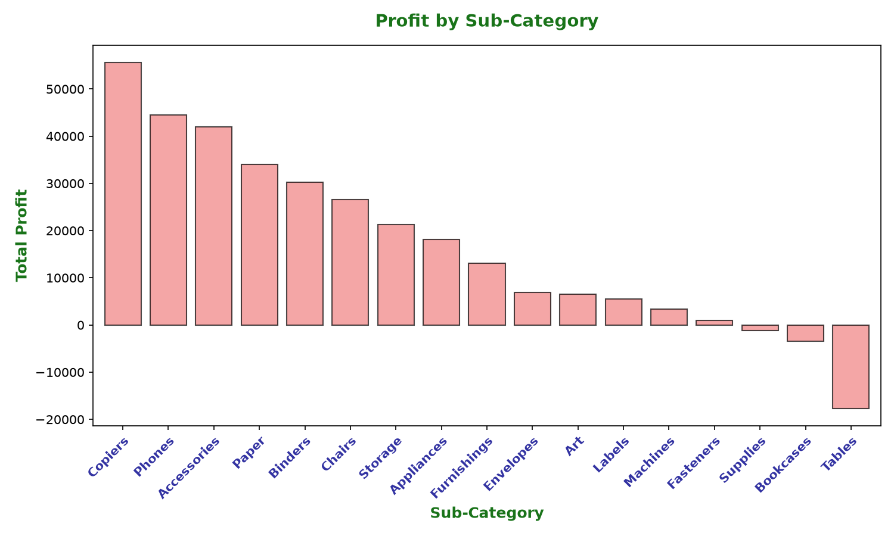
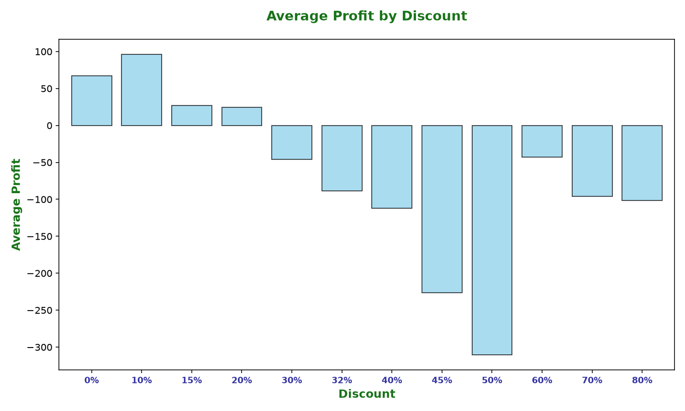
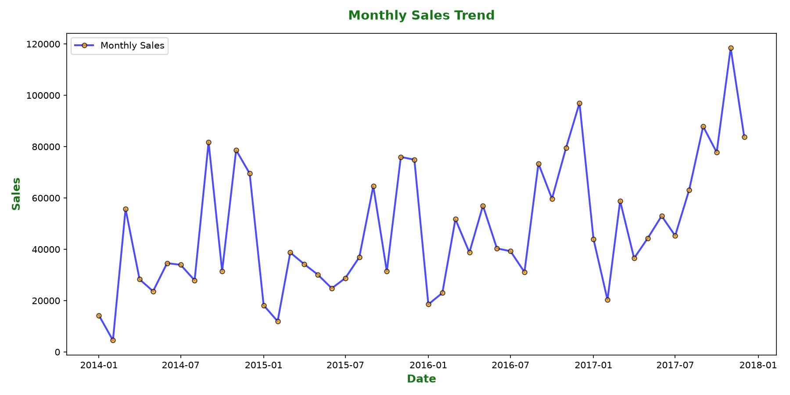

# 📊 Superstore Sales & Profit Analysis

An end-to-end exploratory data analysis of the **Superstore dataset** using Python (pandas, matplotlib) to uncover sales trends, profit drivers, and business problem areas — answering 14 real business questions a retail company would ask.

> 🔜 **Coming soon:** An interactive Power BI dashboard built on the same dataset and insights.

---

## 🛠️ Tools & Tech

- **Python** — pandas, matplotlib
- **Power BI** *(in progress)*
- **Dataset:** Superstore Sales dataset (CSV)

---

## 📁 Project Structure

```
├── Data/
│   └── Raw_Data/
│       └── superstore.csv
├── Visuals/
│   ├── profit_by_subcategory.png
│   ├── avg_profit_by_discount.png
│   └── monthly_sales_trend.png
├── SuperstoreAnalysis.py
└── README.md
```

---

## ❓ Business Questions & Findings

### 1. What is the total sales?
**$2,297,200.86**

### 2. What is the total profit?
**$286,397.02**

### 3. Which category generates the most sales?
**Technology** — $836,154.03

### 4. Which category generates the most profit?
**Technology** — $145,454.95

### 5. Which sub-category is the most profitable?
**Copiers** — $55,618 profit

<!-- IMAGE: Profit by Sub-Category chart -->


### 6. Which products are generating losses?
Top loss-making products include:

| Product | Loss |
|---|---|
| Cubify CubeX 3D Printer Double Head Print | -$8,879.97 |
| Lexmark MX611dhe Monochrome Laser Printer | -$4,589.97 |
| Cubify CubeX 3D Printer Triple Head Print | -$3,839.99 |
| Chromcraft Bull-Nose Wood Oval Conference Tables & Bases | -$2,876.12 |
| Bush Advantage Collection Racetrack Conference Table | -$1,934.40 |
| GBC DocuBind P400 Electric Binding System | -$1,878.17 |
| Cisco TelePresence System EX90 Videoconferencing Unit | -$1,811.08 |

### 7. Which region performs best?
**West** — $725,457.82 in sales

### 8. Which state generates the highest sales?
**California** — $457,687.63

### 9. How do discounts affect profit?
There's a **negative relationship** between discount level and profit — higher discounts are generally associated with lower profitability.

<!-- IMAGE: Average Profit by Discount chart -->


### 10. Which customer segment is most profitable?
**Consumer** — $134,119.20 profit

### 11. How have sales changed over time?
Sales showed an overall **upward trend from 2015 to 2018**, with consistent year-over-year growth each year.

<!-- IMAGE: Monthly Sales Trend chart -->


### 12. Which shipping mode is used most?
**Standard Class** — 5,968 orders

### 13. What are the company's biggest problem areas?
- Loss-making products generating significant negative profit
- High discount levels reducing average profitability
- Certain sub-categories generating low/negative profit despite contributing to sales
- Underperforming regions and states compared to top performers

**Worst performing sub-categories (by profit):**

| Sub-Category | Profit |
|---|---|
| Tables | -$17,725.48 |
| Bookcases | -$3,472.56 |
| Supplies | -$1,189.10 |
| Fasteners | $949.52 |
| Machines | $3,384.76 |

**Regions (by sales):**

| Region | Sales |
|---|---|
| South | $391,721.91 |
| Central | $501,239.89 |
| East | $678,781.24 |
| West | $725,457.82 |

**Weakest states (by sales):**

| State | Sales |
|---|---|
| West Virginia | $1,209.82 |
| Maine | $1,270.53 |
| South Dakota | $1,315.56 |
| Wyoming | $1,603.14 |

### 14. What business recommendations can we make?
- Review **Tables, Bookcases, and Supplies** sub-categories — improve pricing, reduce costs, or discontinue consistently unprofitable products
- Control excessive discounting, which is strongly linked to lower profitability
- Focus on improving sales in the **South region** and other low-performing states through targeted marketing and demand analysis
- Continue investing in **Technology** and **Copiers**, the strongest sales/profit contributors
- Always evaluate profit alongside sales — high sales don't guarantee high profitability
- Study high-performing markets like **West region** and **California** to replicate their strategies elsewhere

---

## 🚀 How to Run

1. Clone the repo
   ```bash
   git clone https://github.com/vidhan-79/Superstore-Sales-profit-Analysis.git
   cd Superstore-Sales-profit-Analysis
   ```
2. Install dependencies
   ```bash
   pip install pandas matplotlib
   ```
3. Run the script
   ```bash
   python SuperstoreAnalysis.py
   ```

---

## 📌 Next Steps

- [ ] Build interactive Power BI dashboard on top of these findings
- [ ] Add filtered views by Region/Segment for deeper drill-down
- [ ] Publish Power BI report link here once complete

---

## 👤 Author

Made by [Vidhan](https://github.com/vidhan-79) — feel free to connect or drop feedback!
